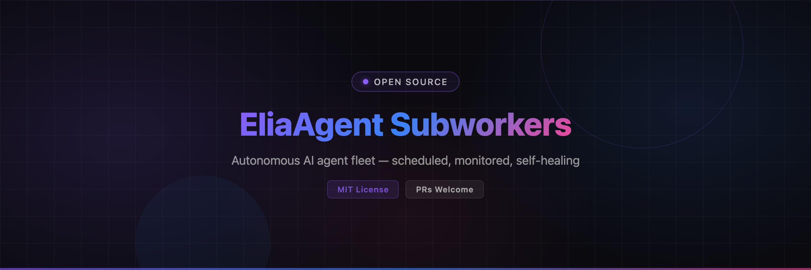

<p align="center">
  
</p>

<p align="center">
  <strong>A fleet of autonomous AI agents that runs your digital life 24/7.</strong><br>
  Scheduled · Monitored · Self-healing · Unlimited tokens
</p>

<p align="center">
  <a href="#-quick-start"></a>
  
  
  
  
</p>

---

## ⚡ Why This Exists

One AI agent is an assistant. A **fleet** is an employee base.

EliaAgent turns OpenCode into a **self-managed fleet of autonomous subworkers** — each with its own personality, workspace, schedule and memory — driven by a Python FastAPI server in Docker:

| | What you get |
|--|--|
| 🕐 **Schedules, not prompts** | Every hour from 9h to 18h, weekdays only, weekends off, cron expressions — set it and forget it |
| 🐳 **4 GB RAM ≈ thousands of sessions** | The Docker runtime isolates and contains OpenCode's known memory leaks that previously caused CPU/RAM blowups |
| ♻️ **Self-healing runs** | Provider outage mid-task? The server detects the transient error, waits a randomized delay, nudges the same session with *"continue the tasks"* — work resumes where it stopped |
| 🔁 **Exponential-backoff retries** | Crashed or timed-out runs retry automatically; session state survives full container nukes |
| 📡 **Realtime everything** | REST API + WebSocket events — live status, streaming logs, reasoning, tool calls |
| 🖥️ **First-class clients** | [EliaTopBar](https://github.com/vakandi/Elia-Topbar) (macOS menu bar) & [EliaAndroidApp](https://github.com/vakandi/EliaAndroidApp) (mobile) |
| 🌍 **Remote access** | Built-in Cloudflare Tunnel wizard — reach your fleet from anywhere, protected by a shared auth token |
| ∞ **Unlimited tokens** | Free OpenCode Zen models + rotating residential proxies = effectively unlimited autonomous work (see [Proxy Rotation](#-unlimited-tokens--proxy-rotation)) |

> 💡 The flagship proof: `refund-hunter` has been hunting e-commerce refund policies **every day for months**, writing reports to Google Docs and handing off state to its next shift — without a single human prompt.

---

## 🚀 Quick Start

```bash
git clone https://github.com/vakandi/EliaAgent.git
cd EliaAgent/subworkers

./install_subworkers.sh    # prerequisites + config + Docker image
./start_subworkers.sh      # opencode server + Docker stack + UI in tmux
```

Health check:

```bash
curl http://localhost:5656/health
# {"status":"ok","timestamp":"...","uptime":...}
```

Then install a client to control the fleet: **[EliaTopBar](https://github.com/vakandi/Elia-Topbar)** (menu bar: trigger, enable/disable, edit schedules with a visual picker, live log viewer per agent).

### Requirements

| Requirement | Notes |
|-------------|-------|
| macOS (Colima) or Linux (Docker) | 4 GB RAM allocated is plenty |
| [OpenCode](https://opencode.ai) | The agent engine — free Zen models, no paid APIs |
| tmux | For the launcher sessions |
| Optional: Discord bot | One panel of the default layout |

---

## 🤖 How to Add a Subworker

This is the core skill of the system. Three files, zero code.

### 1. Create the agent folder

```bash
mkdir -p subworkers/<agent-id>/workspace
touch subworkers/<agent-id>/.enabled        # gate file — presence = active
```

Write `subworkers/<agent-id>/PROMPT.md` — the task instructions injected on every run:

```markdown
# My Agent — PROMPT.md

## Workspace Constraint
You MUST only read and write files inside your workspace/ folder.
All system paths outside workspace/ are blocked.

## Handoff
At the START of every run, read workspace/HANDOFF_NEXT_SESSION.md.
At the END, overwrite it so the next run picks up seamlessly.

## Completion Marker (MANDATORY)
When you build your todo list, ALWAYS include this final task:
"Output <promise>DONE</promise> to signal successful completion".
Only output it as the very last line, after ALL tasks are verified.
The subworker server uses this marker to detect success.
```

### 2. Register the personality

Create `~/.config/opencode/agents/<agent-id>.md` with YAML frontmatter:

```yaml
---
name: <agent-id>
slug: <agent-id>
description: What this agent does every day
mode: all                  # "all" = visible everywhere + callable by the server
model: opencode/big-pickle
temperature: 0.3
tools:
  read: true
  write: true
  edit: true
  bash: true
  glob: true
  grep: true
  webfetch: true
  websearch: true
---
```

Below the frontmatter: persona, workflow, rules. The host OpenCode server loads it at session creation.

### 3. Declare the schedule

Add an entry to `subworkers/server/app/config/subworkers.json`:

```json
{
  "name": "my-agent",
  "enabled": true,
  "schedule": {
    "type": "interval",
    "hours": [9, 10, 11, 12, 13, 14, 15, 16, 17],
    "minute": 0,
    "days": [1, 2, 3, 4, 5]
  },
  "agent_id": "my-agent",
  "max_retries": 3,
  "timeout_minutes": 30
}
```

`days` follows cron convention (`0=Sunday…6=Saturday`) — `[1,2,3,4,5]` = **weekdays only**, `[0,6]` = weekends only, omit for every day. Cron expressions work too: `"type": "cron", "expression": "0 9-17 * * 1-5"`.

The server hot-reloads this file — no restart needed:

```bash
curl -X POST http://localhost:5656/config/reload
```

> 📄 Deep dive (architecture, API contract, failure modes): [`subworkers/SUBWORKERS_SYSTEM.md`](subworkers/SUBWORKERS_SYSTEM.md)

---

## 🏗️ Architecture

```
 EliaTopBar / EliaAndroidApp / Electron UI          ← realtime clients
        │  WebSocket /ws + REST :5656
        ▼
 ┌────────────────────────────────────────────┐
 │  elia-subworker-srv (Docker, FastAPI)      │
 │  ├── APScheduler ← subworkers.json         │
 │  ├── SubworkerRunner                       │
 │  │     ├── provider-error auto-recovery    │
 │  │     ├── retries + exponential backoff   │
 │  │     └── HealthManager (auto-restart)    │
 │  └── SessionMonitor (2s polling)           │
 └──────────────┬─────────────────────────────┘
                │ HTTP (host network)
                ▼
      opencode serve :4096  (HOST process)
                │
    ┌───────────┼───────────┐
    ▼           ▼           ▼
 agent A    agent B    agent N      ← personalities + PROMPT.md
 workspace/ workspace/ workspace/  ← isolated file I/O
```

### Run lifecycle

1. APScheduler fires → runner checks OpenCode health
2. Session created in the agent's isolated workspace (`x-opencode-directory` header)
3. PROMPT.md sent as the user message → agent works (streamed live over WS)
4. Completion = session idle **and** `<promise>DONE</promise>` marker in output
5. Transient provider errors → random wait → *"continue the tasks"* re-injected into the same session (up to 3×)
6. Failure → exponential backoff retries; alerts via macOS beep / ntfy.sh

---

## 🔌 API Quick Reference

| Method | Path | Purpose |
|--------|------|---------|
| GET | `/health` | Server healthcheck |
| GET | `/status` | All subworkers `{name, enabled, running, next_run, schedule}` |
| PUT | `/status/{name}` | Edit config — schedule (hours/minute/**days**), model, variant, timeouts |
| POST | `/trigger/{name}` | Run now (optional `{prompt, model}` body) |
| POST | `/enable/{name}` · `/disable/{name}` | Toggle |
| GET | `/logs/{name}?lines=N` | Recent run-log lines |
| GET | `/sessions/{name}?limit=N` | Full session messages (reasoning, tools, text) |
| GET | `/models` | Model catalog (OpenCode Zen favorites first) |
| GET/POST | `/main-agent` | Read/set the MAIN agent |
| GET | `/server/health` · POST `/server/restart` | OpenCode subprocess control |
| WS | `/ws` | Live events: `initial_status`, `subworker_started`, `run_log`, `subworker_completed`, `subworker_error` |

Auth: shared token via `ELIA_AUTH_TOKEN` (server `.env`) — send as `Authorization: Bearer <token>`.

---

## ∞ Unlimited Tokens — Proxy Rotation

Free OpenCode Zen models have rate limits. Residential proxies make them effectively disappear: rotate IP, keep working.

```bash
# In ~/.zshrc:
alias sp='bash ~/EliaAgent/setup/switch-proxy.sh'           # auto: oldest unused proxy
alias spm='bash ~/EliaAgent/setup/switch-proxy.sh --manual' # manual pick
alias elia='~/EliaAgent/setup/opencode-proxy.sh'            # proxied interactive agent

sp      # rotates, health-checks, verifies your new IP
elia    # unlimited-token agent session through the current proxy
```

- Proxies live in `setup/proxies.txt` (`IP:PORT:USER:PASS` per line — bring your own)
- Health check before switching; dead proxies skipped automatically
- Usage history tracked per proxy
- Scripts detect `.proxy_enabled` and apply `HTTP_PROXY` locally — no global pollution

---

## 🧠 Persistent Memory (codemem)

Every session feeds a per-agent SQLite memory: decisions, bug fixes, discoveries. The next run loads relevant context automatically — agents get smarter every day and never repeat mistakes. 3,400+ sessions indexed across the production fleet.

---

## ❓ Troubleshooting

| Problem | Fix |
|---------|-----|
| Client shows *Disconnected* | Server URL must be `http://localhost:5656` (not 8080) |
| Schedule didn't fire | Check entry in `subworkers.json` (`enabled: true`) then `POST /config/reload` |
| Container down | `cd subworkers/server && docker-compose up -d --build` |
| OpenCode server dead | `POST /server/restart` or restart via launcher |
| Auth errors (401) | Match `ELIA_AUTH_TOKEN` between server `.env` and client |
| Missed runs while laptop slept | Harmless — next slot fires when awake |

---

## 📄 License

MIT — see [LICENSE](LICENSE).
