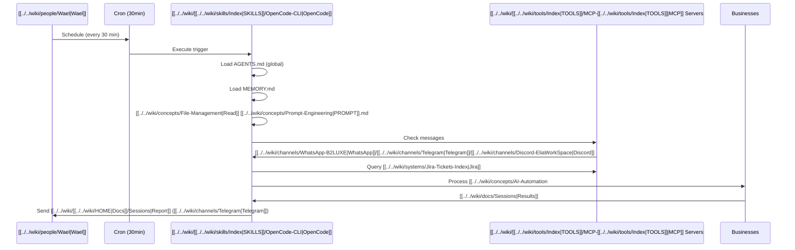

# [[../../wiki/people/Elia|Elia]] [[../../wiki/concepts/AI-Automation|AI]] - Architecture Diagram

## Vue Globale du Système

```mermaid
flowchart TB
    subgraph GLOB["🌍 [[../../wiki/[[../../wiki/skills/Index|SKILLS]]/OpenCode-CLI|OpenCode]] Global System"]
        AGENTS["📋 AGENTS.md<br/>(Global Personality)"]
    end
    
    subgraph [[../../wiki/people/Elia|Elia]]["📁 EliaAI Folder"]
        subgraph CONFIG["⚙️ Configuration"]
            [[../../wiki/concepts/Prompt-Engineering|PROMPT]]["📝 [[../../wiki/concepts/Prompt-Engineering|PROMPT]].md<br/>(Morning Routine)"]
            MEMORY["🧠 MEMORY.md<br/>(Context & Memory)"]
            [[../../wiki/tools/Index|TOOLS]]["🔧 [[../../wiki/tools/Index|TOOLS]].md<br/>([[../../wiki/[[../../wiki/tools/Index|TOOLS]]/MCP-[[../../wiki/tools/Index|TOOLS]]|MCP]] [[../../wiki/tools/Index|TOOLS]])"]
        end
        
        subgraph CRON["⏰ Cron Job System"]
            CRONW["cron_wrapper.sh"]
            CRONM["trigger_morning.sh"]
            TRIG["trigger_opencode_<br/>interactive.sh"]
        end
        
        subgraph EXEC["🚀 Execution Layer"]
            START["start_agents.sh"]
            [[../../wiki/[[../../wiki/skills/Index|SKILLS]]/OpenCode-CLI|OpenCode]]["[[../../wiki/[[../../wiki/skills/Index|SKILLS]]/OpenCode-CLI|OpenCode]] Instance"]
        end
        
        subgraph [[../../wiki/businesses/B2LUXE-BUSINESS|Business]]["💼 Businesses"]
            BEN["[[../../wiki/businesses/Bene2Luxe|Bene2Luxe]]"]
            ZOVA["[[../../wiki/businesses/ZovaBoost|ZovaBoost]]"]
            [[../../wiki/businesses/CoBou-Agency|CoBou]]["[[../../wiki/businesses/CoBou-Agency|CoBou]] Agency"]
            MAYA["[[../../wiki/businesses/Mayavanta|MAYAVANTA]]"]
        end
    end
    
    subgraph COMM["📱 Communication"]
        WA["[[../../wiki/channels/WhatsApp-B2LUXE|WhatsApp]]"]
        TG["[[../../wiki/channels/Telegram|Telegram]]"]
        DC["[[../../wiki/channels/Discord-EliaWorkSpace|Discord]]"]
        EMAIL["Email"]
    end
    
    subgraph [[../../wiki/[[../../wiki/tools/Index|TOOLS]]/MCP-[[../../wiki/tools/Index|TOOLS]]|MCP]]["🔌 [[../../wiki/[[../../wiki/tools/Index|TOOLS]]/MCP-[[../../wiki/tools/Index|TOOLS]]|MCP]] Servers"]
        [[../../wiki/channels/WhatsApp-B2LUXE|WhatsApp]]["[[../../wiki/channels/WhatsApp-B2LUXE|WhatsApp]] [[../../wiki/[[../../wiki/tools/Index|TOOLS]]/MCP-[[../../wiki/tools/Index|TOOLS]]|MCP]]"]
        [[../../wiki/channels/Telegram|Telegram]]["[[../../wiki/channels/Telegram|Telegram]] [[../../wiki/[[../../wiki/tools/Index|TOOLS]]/MCP-[[../../wiki/tools/Index|TOOLS]]|MCP]]"]
        [[../../wiki/channels/Discord-EliaWorkSpace|Discord]]["[[../../wiki/channels/Discord-EliaWorkSpace|Discord]] [[../../wiki/[[../../wiki/tools/Index|TOOLS]]/MCP-[[../../wiki/tools/Index|TOOLS]]|MCP]]"]
        [[../../wiki/systems/Jira-Tickets-Index|Jira]]["[[../../wiki/systems/Jira-Tickets-Index|Jira]] [[../../wiki/[[../../wiki/tools/Index|TOOLS]]/MCP-[[../../wiki/tools/Index|TOOLS]]|MCP]]"]
        [[../../wiki/systems/SSH-Servers|SSH]]["[[../../wiki/systems/SSH-Servers|SSH]] [[../../wiki/[[../../wiki/tools/Index|TOOLS]]/MCP-[[../../wiki/tools/Index|TOOLS]]|MCP]]"]
    end
    
    AGENTS -->|Loads in every<br/>[[../../wiki/[[../../wiki/skills/Index|SKILLS]]/OpenCode-CLI|OpenCode]] folder| [[../../wiki/people/Elia|Elia]]
    [[../../wiki/concepts/Prompt-Engineering|PROMPT]] -->|Defines workflow| START
    MEMORY -->|Provides context| START
    [[../../wiki/tools/Index|TOOLS]] -->|Enables [[../../wiki/tools/Index|TOOLS]]| START
    CRONW -->|Wraps execution| TRIG
    CRONM -->|Morning trigger| TRIG
    TRIG -->|Starts| START
    START -->|Spawns| [[../../wiki/[[../../wiki/skills/Index|SKILLS]]/OpenCode-CLI|OpenCode]]
    
    [[../../wiki/[[../../wiki/skills/Index|SKILLS]]/OpenCode-CLI|OpenCode]] -->|Manages| BEN
    [[../../wiki/[[../../wiki/skills/Index|SKILLS]]/OpenCode-CLI|OpenCode]] -->|Manages| ZOVA
    [[../../wiki/[[../../wiki/skills/Index|SKILLS]]/OpenCode-CLI|OpenCode]] -->|Manages| [[../../wiki/businesses/CoBou-Agency|CoBou]]
    [[../../wiki/[[../../wiki/skills/Index|SKILLS]]/OpenCode-CLI|OpenCode]] -->|Manages| MAYA
    
    BEN -.->|Messages| WA
    ZOVA -.->|Messages| TG
    [[../../wiki/businesses/CoBou-Agency|CoBou]] -.->|Messages| DC
    MAYA -.->|Messages| EMAIL
    
    WA --> [[../../wiki/channels/WhatsApp-B2LUXE|WhatsApp]]
    TG --> [[../../wiki/channels/Telegram|Telegram]]
    DC --> [[../../wiki/channels/Discord-EliaWorkSpace|Discord]]
    EMAIL --> [[../../wiki/systems/Jira-Tickets-Index|Jira]]
    
    [[../../wiki/channels/WhatsApp-B2LUXE|WhatsApp]] -->|[[../../wiki/[[../../wiki/tools/Index|TOOLS]]/MCP-[[../../wiki/tools/Index|TOOLS]]|MCP]] Calls| [[../../wiki/[[../../wiki/skills/Index|SKILLS]]/OpenCode-CLI|OpenCode]]
    [[../../wiki/channels/Telegram|Telegram]] -->|[[../../wiki/[[../../wiki/tools/Index|TOOLS]]/MCP-[[../../wiki/tools/Index|TOOLS]]|MCP]] Calls| [[../../wiki/[[../../wiki/skills/Index|SKILLS]]/OpenCode-CLI|OpenCode]]
    [[../../wiki/channels/Discord-EliaWorkSpace|Discord]] -->|[[../../wiki/[[../../wiki/tools/Index|TOOLS]]/MCP-[[../../wiki/tools/Index|TOOLS]]|MCP]] Calls| [[../../wiki/[[../../wiki/skills/Index|SKILLS]]/OpenCode-CLI|OpenCode]]
    [[../../wiki/systems/Jira-Tickets-Index|Jira]] -->|[[../../wiki/[[../../wiki/tools/Index|TOOLS]]/MCP-[[../../wiki/tools/Index|TOOLS]]|MCP]] Calls| [[../../wiki/[[../../wiki/skills/Index|SKILLS]]/OpenCode-CLI|OpenCode]]
```

---

## Architecture [[../../wiki/[[../../wiki/skills/Index|SKILLS]]/OpenCode-CLI|OpenCode]] - Detail

```mermaid
flowchart LR
    subgraph OPENCODE_INSTANCE["[[../../wiki/[[../../wiki/skills/Index|SKILLS]]/OpenCode-CLI|OpenCode]] Instance"]
        direction TB
        GLOBAL["📋 ~/.config/[[../../wiki/[[../../wiki/skills/Index|SKILLS]]/OpenCode-CLI|OpenCode]]/AGENTS.md<br/>(Global - Loaded Every [[../../wiki/topics/Infrastructure-Timeline|Time]])"]
        [[../../wiki/systems/Docker-Servers|Local]]["📁 ./AGENTS.md<br/>(Folder-Specific)"]
        [[../../wiki/skills/Index|SKILLS]]["🛠️ ./[[../../wiki/skills/Index|SKILLS]]/<br/>(Custom [[../../wiki/skills/Index|SKILLS]])"]
        [[../../wiki/concepts/Prompt-Engineering|PROMPT]]["📝 [[../../wiki/concepts/Prompt-Engineering|PROMPT]]/Input"]
        
        GLOBAL --> [[../../wiki/systems/Docker-Servers|Local]]
        [[../../wiki/systems/Docker-Servers|Local]] --> [[../../wiki/skills/Index|SKILLS]]
        [[../../wiki/skills/Index|SKILLS]] --> [[../../wiki/concepts/Prompt-Engineering|PROMPT]]
    end
    
    subgraph CRON_EXECUTION["Cron Job Execution"]
        CRON["⏰ macOS Cron<br/>(Every 30 min)"]
        WRAPPER["cron_wrapper.sh"]
        TRIGGER["trigger_opencode_interactive.sh"]
        AGENT["🤖 [[../../wiki/[[../../wiki/skills/Index|SKILLS]]/OpenCode-CLI|OpenCode]] Agent"]
        
        CRON --> WRAPPER
        WRAPPER --> TRIGGER
        TRIGGER --> AGENT
    end
    
    CRON_EXECUTION -->|Uses| OPENCODE_INSTANCE
```

---

## Flux de Données



---

## Structure des Fichiers Clés

```
📁 /Users/vakandi/EliaAI/
│
├── 📋 AGENTS.md              ← INHERITED from ~/.config/[[../../wiki/[[../../wiki/skills/Index|SKILLS]]/OpenCode-CLI|OpenCode]]/ (GLOBAL)
│                             ← Defines: [[../../wiki/people/Elia|Elia]]'s personality, businesses, rules
│
├── ⚙️  Configuration/
│   ├── [[../../wiki/concepts/Prompt-Engineering|PROMPT]].md             ← Morning routine workflow
│   ├── MEMORY.md             ← Long-term context & learnings
│   ├── context/[[../../wiki/tools/Index|TOOLS]].md       ← [[../../wiki/[[../../wiki/tools/Index|TOOLS]]/MCP-[[../../wiki/tools/Index|TOOLS]]|MCP]] tool commands
│   └── context/[[../../wiki/businesses/B2LUXE-BUSINESS|Business]].md    ← [[../../wiki/businesses/B2LUXE-BUSINESS|Business]] details
│
├── ⏰ Cron Automation/
│   ├── cron_wrapper.sh        ← Cron entry point
│   ├── trigger_morning.sh     ← Morning execution
│   └── trigger_opencode_interactive.sh  ← Main launcher
│
├── 🛠️  [[../../wiki/skills/Index|SKILLS]] & [[../../wiki/tools/Index|TOOLS]]/
│   ├── [[../../wiki/skills/Index|SKILLS]]/                ← Custom [[../../wiki/people/Elia|Elia]] [[../../wiki/skills/Index|SKILLS]]
│   ├── [[../../wiki/tools/Index|TOOLS]]/                 ─ Utility [[../../wiki/concepts/Marketing-Concepts|Scripts]]
│   └── setup/                 ← Voice synthesis
│
└── 📱 Communication/
    ├── [[../../wiki/channels/WhatsApp-B2LUXE|WhatsApp]] ([[../../wiki/[[../../wiki/tools/Index|TOOLS]]/MCP-[[../../wiki/tools/Index|TOOLS]]|MCP]])
    ├── [[../../wiki/channels/Telegram|Telegram]] ([[../../wiki/[[../../wiki/tools/Index|TOOLS]]/MCP-[[../../wiki/tools/Index|TOOLS]]|MCP]])
    ├── [[../../wiki/channels/Discord-EliaWorkSpace|Discord]] ([[../../wiki/[[../../wiki/tools/Index|TOOLS]]/MCP-[[../../wiki/tools/Index|TOOLS]]|MCP]])
    └── Email (agent-browser)
```

---

## Points Clés pour Sebbon

### 🔑 Concept Principal

**[[../../wiki/[[../../wiki/skills/Index|SKILLS]]/OpenCode-CLI|OpenCode]] a un système AGENTS.md GLOBAL** qui est chargé à chaque fois qu'une instance [[../../wiki/[[../../wiki/skills/Index|SKILLS]]/OpenCode-CLI|OpenCode]] démarre, peu importe le dossier. C'est ce fichier qui donne sa personnalité à [[../../wiki/people/Elia|Elia]] (nom, rôle, règles, businesses).

### 📂 Structure

1. **`~/.config/[[../../wiki/[[../../wiki/skills/Index|SKILLS]]/OpenCode-CLI|OpenCode]]/AGENTS.md`** = **GLOBAL** (personnalité [[../../wiki/people/Elia|Elia]])
2. **`/Users/vakandi/EliaAI/`** = Le dossier de travail d'[[../../wiki/people/Elia|Elia]]
3. **Chaque dossier [[../../wiki/[[../../wiki/skills/Index|SKILLS]]/OpenCode-CLI|OpenCode]]** = Peut avoir son propre `AGENTS.md` qui override le global

### ⏰ Système Cron

- **macOS Cron** → exécute `cron_wrapper.sh` toutes les 30 minutes
- **Wrapper** → charge l'environnement → lance `trigger_opencode_interactive.sh`
- **Trigger** → exécute `start_agents.sh` qui démarre [[../../wiki/[[../../wiki/skills/Index|SKILLS]]/OpenCode-CLI|OpenCode]] avec [[../../wiki/people/Elia|Elia]]

### 🔌 [[../../wiki/[[../../wiki/tools/Index|TOOLS]]/MCP-[[../../wiki/tools/Index|TOOLS]]|MCP]] [[../../wiki/tools/Index|TOOLS]]

[[../../wiki/[[../../wiki/skills/Index|SKILLS]]/OpenCode-CLI|OpenCode]] utilise des "[[../../wiki/[[../../wiki/tools/Index|TOOLS]]/MCP-[[../../wiki/tools/Index|TOOLS]]|MCP]] Servers" (Model Context Protocol) pour:
- **[[../../wiki/channels/WhatsApp-B2LUXE|WhatsApp]]/[[../../wiki/channels/Telegram|Telegram]]/[[../../wiki/channels/Discord-EliaWorkSpace|Discord]]** → Lire/envoyer des messages
- **[[../../wiki/systems/Jira-Tickets-Index|Jira]]** → Créer des tickets
- **[[../../wiki/systems/SSH-Servers|SSH]]** → Commander les serveurs
- **agent-browser** → Automatisation web

### 💡 Pourquoi c'est puissant?

1. **Autonome** → Fonctionne 24/7 sans intervention
2. **Contextualisé** → MEMORY.md conserve l learnings
3. **Polyglotte** → Parle français/anglais selon le contexte
4. **Multi-[[../../wiki/businesses/B2LUXE-BUSINESS|Business]]** → Gère 8 entreprises simultanément

---

## Résumé Visuel Simple

```
┌─────────────────────────────────────────────────────────────┐
│                    [[../../wiki/[[../../wiki/skills/Index|SKILLS]]/OpenCode-CLI|OpenCode]] (Global)                       │
│              ~/.config/[[../../wiki/[[../../wiki/skills/Index|SKILLS]]/OpenCode-CLI|OpenCode]]/AGENTS.md                  │
│         ↑ Donne SA PERSONNALITÉ à [[../../wiki/people/Elia|Elia]] ↑                   │
└─────────────────────────────────────────────────────────────┘
                              │
                              ▼
┌─────────────────────────────────────────────────────────────┐
│               /Users/vakandi/EliaAI/                        │
│  ┌──────────────┐ ┌──────────────┐ ┌──────────────────┐   │
│  │ [[../../wiki/concepts/Prompt-Engineering|PROMPT]].md    │ │ MEMORY.md    │ │ cron_wrapper.sh  │   │
│  │ (Morning)    │ │ (Context)    │ │ (Cron - 30min)   │   │
│  └──────────────┘ └──────────────┘ └──────────────────┘   │
│           │              │                  │               │
│           └──────────────┼──────────────────┘               │
│                          ▼                                  │
│              ┌───────────────────────┐                     │
│              │   [[../../wiki/[[../../wiki/skills/Index|SKILLS]]/OpenCode-CLI|OpenCode]] Instance   │                     │
│              │   ([[../../wiki/people/Elia|Elia]] [[../../wiki/concepts/AI-Automation|AI]] Agent)      │                     │
│              └───────────────────────┘                     │
│                          │                                  │
│           ┌──────────────┼──────────────┐                   │
│           ▼              ▼              ▼                   │
│      ┌────────┐    ┌─────────┐    ┌──────────┐             │
│      │[[../../wiki/channels/WhatsApp-B2LUXE|WhatsApp]]│    │[[../../wiki/channels/Telegram|Telegram]] │    │ [[../../wiki/channels/Discord-EliaWorkSpace|Discord]]  │             │
│      │  [[../../wiki/[[../../wiki/tools/Index|TOOLS]]/MCP-[[../../wiki/tools/Index|TOOLS]]|MCP]]   │    │   [[../../wiki/[[../../wiki/tools/Index|TOOLS]]/MCP-[[../../wiki/tools/Index|TOOLS]]|MCP]]   │    │   [[../../wiki/[[../../wiki/tools/Index|TOOLS]]/MCP-[[../../wiki/tools/Index|TOOLS]]|MCP]]    │             │
│      └────────┘    └─────────┘    └──────────┘             │
│           │              │              │                    │
│           └──────────────┼──────────────┘                    │
│                          ▼                                  │
│              ┌───────────────────────┐                     │
│              │  [[../../wiki/people/Wael|Wael]]'s Businesses    │                     │
│              │  [[../../wiki/businesses/Bene2Luxe|Bene2Luxe]], [[../../wiki/businesses/ZovaBoost|ZovaBoost]] │                     │
│              │  [[../../wiki/businesses/CoBou-Agency|CoBou]], [[../../wiki/businesses/Mayavanta|MAYAVANTA]]...  │                     │
│              └───────────────────────┘                     │
└─────────────────────────────────────────────────────────────┘
```
