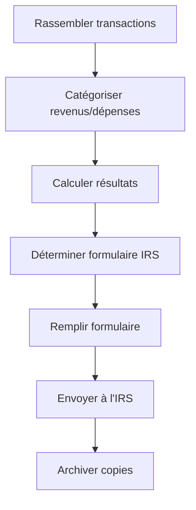

# 📖 GUIDE FISCAL - COBOU AGENCY LLC
## Comment déclarer les taxes pour votre LLC américaine (2026+)
**Préparé par:** Elia AI | **Date:** 9 Mai 2026

---

## 📑 TABLE DES MATIÈRES
1. [Comprendre votre statut fiscal](#1-comprendre-votre-statut-fiscal)
2. [Quel formulaire IRS utiliser ?](#2-quel-formulaire-irs-utiliser)
3. [Processus étape par étape](#3-processus-étape-par-étape)
4. [Échéances fiscales](#4-échéances-fiscales)
5. [Bonnes pratiques](#5-bonnes-pratiques)
6. [Outils & Ressources](#6-outils--ressources)

---

## 1. COMPRENDRE VOTRE STATUT FISCAL

### Qui est Cobou Agency LLC ?
- **Type:** LLC (Limited Liability Company)
- **Propriétaire:** Wael Bousfira (Résident français/marocain)
- **Activité:** Services digitaux (dev web, e-commerce, marketing)
- **Revenus:** Clients européens/marocains (NON américains)
- **Présence US:** Aucune (pas de bureau, employé, ou agent aux US)

### Principe Clé
💡 **Une LLC étrangère sans présence physique aux US**
   **+ Revenus de source NON américaine**
   **= PAS D'IMPÔT US À PAYER (0%)**

### MAIS: 3 obligations possibles
| Obligation | Si... |
|------------|-------|
| **1. Aucune déclaration** | LLC disregarded entity + pas d'ECI |
| **2. Form 1065** | Si multi-members (partenariat) |
| **3. Form 5472** | Si élection corporate + transactions liées |

---

## 2. QUEL FORMULAIRE IRS UTILISER ?

### Scénario A: Single-Member LLC (Recommandé ✅)
| Situation | Form | Effet |
|-----------|------|-------|
| Pas de revenus US + pas d'ECI | **Aucun filing requis** | ✅ Le plus simple |
| Revenus US accessoires | Form 1040-NR + Schedule C | ⚠️ Si > $0 |
| Transactions avec parties liées | Form 5472 (+ Pro Forma 1120) | Informational |

### Scénario B: Multi-Member LLC
| Situation | Form | Deadlines |
|-----------|------|-----------|
| 2+ membres | **Form 1065** (Partnership Return) | 15 Mars |
| Perte fiscale | Reportable sur K-1 | N/A |
| Distributions | Schedule K-1 (Box 19) | Annual |

### Scénario C: Corporate Election (Form 8832)
| Situation | Form | Effet |
|-----------|------|-------|
| Élection C-Corp | **Form 1120** (si C-Corp) | 21% flat tax |
| Élection S-Corp | **Form 1120-S** (si S-Corp) | Pass-through |

---

## 3. PROCESSUS ÉTAPE PAR ÉTAPE

### 🗓️ ANNUEL - Préparation (Janvier-Février)



### Étape 1: Rassembler les transactions
□ Relevés bancaires (Wise, Mercury, autres)
□ Transactions Stripe (export CSV)
□ Factures émises
□ Factures reçues (dépenses)
□ Relevés PayPal/crypto
□ Screenshots WhatsApp/Discord des paiements

### Étape 2: Catégoriser (template Excel)
```csv
Date, Description, Montant, Catégorie, Projet, Client
2026-01-15, "Paiement Thomas - Dev site", -500.00, "Team Payment", "Projet X", "Client Y"
2026-01-20, "Virement client", 1500.00, "Revenue", "Projet Y", "Client Z"
```

### Étape 3: Calculer les résultats
```
Revenus totaux - Dépenses totales = Résultat net
```

### Étape 4: Remplir le formulaire IRS
Utiliser les données structurées du Step 2 pour remplir:
- Form 1065: Lines 1a (Gross receipts), Line 22 (Total deductions)
- Schedule C: Lines 1 (Income), Line 28 (Net profit)

### Étape 5: Envoyer
- **Mail:** Internal Revenue Service, Ogden, UT 84201-0011
- **E-file:** Via tax preparer ou software (Drake, UltraTax)
- **Extension:** Form 7004 (6 mois supplémentaires)

---

## 4. ÉCHÉANCES FISCALES 2026-2027

| Échéance | Pour | Concernant |
|----------|------|------------|
| **15 Mars 2027** | Form 1065 | Année fiscale 2026 |
| **15 Avril 2027** | Form 1040-NR | Année fiscale 2026 |
| **15 Septembre 2027** | Extension deadline | Si Form 7004 déposé |
| **31 Décembre 2026** | Estimated tax Q4 | Si > $1,000 dû |
| **15 Janvier 2027** | Estimated tax Q1 2027 | | 

### Ce qui est déjà en retard (Mai 2026):
❌ **15 Mars 2026** - Form 1065 2025 (si partnership) - **55 jours de retard**
❌ **15 Avril 2026** - Schedule C/1040-NR 2025 - **24 jours de retard**

---

## 5. BONNES PRATIQUES

### 📁 Organisation
- **Dossier dédié:** `CobouAgency/Taxes/{ANNEE}/`
- **Fichiers annuels:** Relevés bancaires, factures, contrats
- **Google Sheets:** Template de compta mis à jour mensuellement
- **Backup:** Versions PDF de TOUS les documents

### 💳 Gestion Financière
- ✅ **Séparer** compte perso et pro (déjà fait avec Wise 👍)
- ✅ **Noter** chaque transaction avec sa catégorie
- ⚠️ **Documenter** les apports en capital de Wael vs prêts
- ⚠️ **Justifier** chaque dépense (facture, screenshot)

### 🤖 Automatisation (Elia peut aider)
- 📊 Générer rapports mensuels automatiques
- 💬 Analyser messages WhatsApp/Discord pour trouver des transactions
- 📑 Pré-remplir les formulaires IRS
- 📅 Rappels d'échéances

### ❌ Erreurs à Éviter
| Erreur | Conséquence | Solution |
|--------|-------------|----------|
| Mélanger comptes perso/pro | Comptabilité illisible | ✅ Wise dédié |
| Pas de justificatifs | Dépenses non déductibles | Screenshot + facture |
| Oublier Form 5472 | Pénalités $25K+ | Vérifier annuellement |
| Pas d'EIN | Impossible d'opérer | ✅ SS-4 déjà rempli |
| Ignorer deadlines | Pénalités + intérêts | Calendrier + rappels |

---

## 6. OUTILS & RESSOURCES

### Outils Recommandés
| Outil | Usage | Prix |
|-------|-------|------|
| **Wise** | Compte bancaire pro | ✅ Déjà utilisé |
| **Mercury** | Banque US | ✅ En cours |
| **Google Sheets** | Comptabilité | ✅ Gratuit |
| **IRS.gov** | Formulaires officiels | Gratuit |
| **TaxSlayer** | E-filing 1065 | ~$50 |
| **Drake Software** | Pro tax prep | ~$1,000 |

### Liens IRS Utiles
- 📄 Form 1065 (2025): https://www.irs.gov/pub/irs-pdf/f1065.pdf
- 📄 Instructions 1065: https://www.irs.gov/pub/irs-pdf/i1065.pdf
- 📄 Form 5472: https://www.irs.gov/pub/irs-pdf/f5472.pdf
- 📄 Form SS-4 (EIN): https://www.irs.gov/pub/irs-pdf/fss4.pdf
- 📄 Form 7004 (Extension): https://www.irs.gov/pub/irs-pdf/f7004.pdf

### Checklist Annuelle (à coller sur le mur 🖨️)
```
[ ] Jan: Rassembler tous les relevés bancaires de l'année
[ ] Fév: Catégoriser TOUTES les transactions
[ ] Fév: Compiler les factures clients et dépenses
[ ] 1 Mars: Préparer le brouillon du formulaire IRS
[ ] 15 Mars: ENVOYER Form 1065 (ou extension)
[ ] 15 Avril: ENVOYER Form 1040-NR (si applicable)
[ ] Avril: Archiver tous les documents dans /Taxes/ANNEE/
[ ] Déc: Vérifier les estimated taxes pour l'année suivante
```

---

## RÉSUMÉ EXÉCUTIF

```
┌─────────────────────────────────────────────────────────────┐
│                                                             │
│   COBOU AGENCY LLC - GUIDE FISCAL                           │
│                                                             │
│   1. IMPÔT À PAYER: $0 (0% - revenus de source étrangère)  │
│   2. DÉCLARATION: Form 1065 (si partnership) ou Schedule C │
│   3. STATUT 2025: 24 jours de retard - AGIR MAINTENANT     │
│   4. PÉNALITÉS: Minimes si aucun impôt dû                  │
│   5. PROCHAIN DEADLINE: 15 Mars 2027 (FY 2026)             │
│                                                             │
└─────────────────────────────────────────────────────────────┘
```

---

*Document préparé par Elia AI pour Bousfira Wael - Cobou Agency LLC*
*Ce guide est à titre informatif. Consultez un CPA pour des conseils fiscaux spécifiques.*
