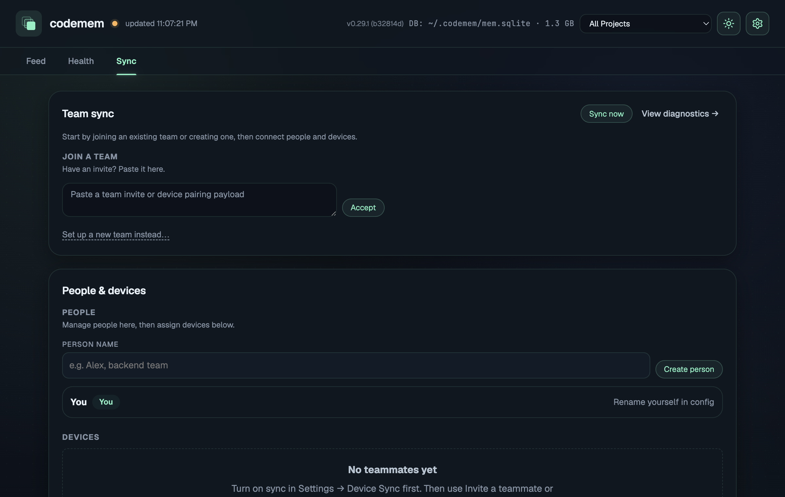

# EliaAI – Self-Improving AI Agent with Persistent Memory

**⚠️ MODEL: This system uses ONLY free OpenCode models (big-pickle recommended). DO NOT use Claude/GPT/paid models.**

Commit : [main 9691e71] update1763 confirmed working perfectly on MacOS with memory + docs affined (Update made on [main 7f960f3] update13401)

---

## 🧠 Self-Improving AI Agent with Persistent Memory

**EliaAI's most powerful feature: the agent remembers everything and gets smarter with every session.**

Unlike traditional AI agents that start from scratch on each interaction, EliaAI uses a **persistent memory system (codemem)** that captures every session, every decision, every fix, and every discovery — then feeds it back into future sessions.

### How It Works

```
┌─────────────────────────────────────────────────────────────────┐
│                        CODEMEM LOOP                              │
│                                                                  │
│  Agent Session ──→ Captures decisions, bugs, discoveries         │
│       │                                                          │
│       ▼                                                          │
│  SQLite DB (1.3 GB+) ──→ Per-agent indexed memory                │
│       │                                                          │
│       ▼                                                          │
│  On next run → Agent automatically loads relevant past           │
│  context → avoids previous mistakes, builds on past work         │
│       │                                                          │
│       ▼                                                          │
│  Agent gets smarter every session ──→ Loop repeats               │
│                                                                  │
└─────────────────────────────────────────────────────────────────┘
```

### Key Features

| Feature | Benefit |
|---------|---------|
| **Per-agent memory scoping** | Each subagent (Gilfoyle, Setbon, Picasso, etc.) has its own indexed history — no context pollution |
| **Automatic context injection** | On each run, the agent automatically loads relevant past sessions, decisions, and bug fixes |
| **Hybrid search** | Combines semantic (embedding) + keyword search for maximum relevance |
| **1.3 GB+ knowledge base** | Over 3,400+ sessions indexed — years of accumulated experience |
| **Sync across devices** | Multiple machines share memory via the team sync system |
| **Handoff continuity** | Session summaries preserve context across task switches and agent changes |

### Memory Viewer Dashboard

Monitor your agent's memory in real-time: session history, health metrics, and sync status.



*The codemem dashboard showing per-agent memory, health status, database size, and sync/team management.*

### What the Agent Remembers

- ✅ **Bug fixes & root causes** — Never makes the same mistake twice
- ✅ **Business decisions** — Remembers why certain architectural choices were made
- ✅ **User preferences** — Adapts to your communication style and workflow
- ✅ **Discovered solutions** — Reuses past solutions instead of reinventing
- ✅ **Project context** — Understands the full scope of each project
- ✅ **Dependencies & gotchas** — Remembers which versions work and which break

### The Self-Improvement Cycle

Every time you run EliaAI:

1. **Session runs** — Agent works on your tasks
2. **Key insights captured** — Decisions, fixes, discoveries, and mistakes are extracted
3. **Indexed in SQLite** — Stored per-agent with full-text + semantic search
4. **Next session loads relevant memory** — Agent starts with context from past sessions
5. **Agent gets smarter** — Knows more, makes fewer mistakes, works faster

This means **the more you use it, the better it gets**. After 3,400+ sessions, the agent has accumulated years of practical experience across backend development, marketing, e-commerce, system administration, and business operations.

### Track Record

| Metric | Value |
|--------|-------|
| Total sessions indexed | 3,400+ |
| Database size | 1.3 GB |
| Active subagents with scoped memory | 15+ |
| Continuous improvement | Every session |

> 💡 **The memory system is what makes EliaAI not just an AI assistant, but a continuously improving digital colleague that learns from experience.**

---

## Elia UI Preview

### Main Interface


Below the main UI, showing the central orb with animated GIF, model selection badges (BigPickle, Kimi2.5, MiniMax2.5), CRON toggle, and status indicators.

### Model Selection

| Model | Badge Color | Context | Tokens |
|-------|-------------|---------|--------|
| BigPickle | 🔴 Red | 200K | 200K |
| Kimi2.5 | 🟢 Green | 128K | 128K |
| MiniMax2.5 | 🟡 Yellow | 1M | 1M |

### Cron Job Configuration

Configure automated scheduled runs (every 30min, 1h, 1h30, or 2h).

| Interval | Description |
|----------|-------------|
| 30m | Every 30 minutes |
| 1h | Every hour |
| 1h30 | Every 1.5 hours |
| 2h | Every 2 hours |


### Morning Routine

Automated morning briefings and status reports sent via Telegram/WhatsApp.


### Proxy Settings

Configure proxy settings for network requests and API calls.


---

EliaAI runs an AI agent (OpenCode) on a schedule and from the **Elia** overlay. You pick the model in the UI; that same choice is used for voice runs and for the **every-2-hour cron job**.

---

## Table of Contents

- [Self-Improving AI Agent with Persistent Memory](#-self-improving-ai-agent-with-persistent-memory)
- [Overview](#overview)
- [Proxy Switcher](#proxy-switcher)
- [Elia UI (Electron)](#elia-ui-electron)
- [Model selection (UI → cron)](#model-selection-ui--cron)
- [Scheduled runs (cron or LaunchAgent)](#scheduled-runs-cron-or-launchagent)
- [Manual & voice runs](#manual--voice-runs)
- [Subagent System](#subagent-system)
- [Key files & layout](#key-files--layout)
- [Troubleshooting](#troubleshooting)
- [Discord Integration](#discord-integration)
- [Legacy / other backends](#legacy--other-backends)
- [Telemetry (Langfuse)](#telemetry-langfuse)
- [SETUP GUIDE: Installing for Yourself](#setup-guide-installing-for-yourself)

---

## Overview

| Part | Role |
|------|------|
| **Elia (ui_electron)** | Floating overlay: pick AI model (BigPickle / Kimi2.5 / MiniMax2.5), click orb to run voice dictate. |
| **start_agents.sh** | Entry point for runs: `--model=...` and optional `--extra-prompt`. |
| **trigger_opencode_interactive.sh** | What cron/voice/Telegram runs: uses `oh-my-opencode` for rich logging and ULW-Loop support. |
| **.opencode_model** | One line: `big-pickle` \| `nvidia` \| `minimax`. Set by Elia when you change the model. |
| **manage_cron.sh** | Install/uninstall/show the scheduled job (user or root crontab with `--sudo`). |

Flow: **Elia model choice** → saved in UI and in **`.opencode_model`** → **cron/LaunchAgent** runs `trigger_opencode_interactive.sh` → script reads `.opencode_model` and uses **`oh-my-opencode run -a elia`** for rich logging.

---

## Proxy Switcher

Automatic proxy rotation with history tracking. **Updated May 3, 2026** - Robust HTTP_PROXY approach after proxychains4 issue on May 2, 2026.

### Issue (May 2, 2026)

On May 2, 2026, `proxychains4` stopped intercepting OpenCode network requests properly. Despite being installed and configured, opencode requests were not being routed through the proxy. This was diagnosed as a macOS SIP (System Integrity Protection) limitation where signed binaries cannot have libraries injected.

### Solution: HTTP_PROXY Environment Variables

Instead of using `proxychains4` library injection, we now use **HTTP_PROXY environment variables** applied locally to each command. This approach:

- ✅ **Works reliably** - No SIP limitations
- ✅ **Doesn't pollute the terminal** - Proxy vars are applied only to the specific command using `env`
- ✅ **Compatible with all scripts** - Works with opencode, oh-my-opencode, Discord bot, etc.
- ✅ **Easy to debug** - Can verify proxy by checking the command's environment

### Files

| File | Purpose |
|------|---------|
| `setup/proxies.txt` | Proxy list with IP:PORT:USER:PASS format |
| `~/.proxychains.conf` | Generated config (still used for proxy storage) |
| `~/.proxychains.current` | Tracks currently selected proxy |
| `setup/opencode-proxy.sh` | Wrapper script for opencode with HTTP_PROXY |
| `EliaAI/.proxy_enabled` | Flag file to enable proxy in scripts |

### Usage

```bash
sp    # Auto mode - picks oldest/unused proxy
spm   # Manual mode - show list, you pick
```

### Features

- **Auto mode**: Picks the proxy that hasn't been used in the longest time (or never used)
- **Health check**: Tests each proxy before selecting - skips dead ones
- **History tracking**: Records when each proxy was last used and for how long
- **IP verification**: Shows your new IP after switching via ipify.org

### Proxy File Format

```
IP:PORT:USERNAME:PASSWORD
```

Example:
```
[proxy-ip:port:user:pass]
[proxy-ip:port:user:pass]
```

After use, history is appended:
```
[proxy-ip:port:user:pass] |last:2026-03-24 01:17:42 |dur:0h 5m
```

### Setup

**macOS:**

```bash
# Add to ~/.zshrc
alias sp='bash ~/EliaAI/setup/switch-proxy.sh'
alias spm='bash ~/EliaAI/setup/switch-proxy.sh --manual'

# Proxychains aliases (for curl testing)
alias pcurl='proxychains4 -f ~/.proxychains.conf /opt/homebrew/opt/curl/bin/curl'

# Elia alias with proxy
alias elia='~/EliaAI/setup/opencode-proxy.sh'

# Reload shell
source ~/.zshrc
```

**Linux:**

```bash
# Add to ~/.bashrc
alias sp='bash /home/YOUR_USER/scripts/switch-proxy.sh'
alias spm='bash /home/YOUR_USER/scripts/switch-proxy.sh --manual'

# Reload shell
source ~/.bashrc
```

**Windows (WSL):**

```bash
# Add to ~/.bashrc (same as Linux)
alias sp='bash /home/YOUR_USER/scripts/switch-proxy.sh'
alias spm='bash /home/YOUR_USER/scripts/switch-proxy.sh --manual'
```

### Running Commands Through Proxy

**Automatic via scripts (cron, voice, manual):**

Scripts automatically detect proxy via `.proxy_enabled` file or `USE_PROXY=1` flag and apply HTTP_PROXY locally:

```bash
# Enable proxy
touch ~/EliaAI/.proxy_enabled

# Run with proxy (automatic)
./start_agents.sh --extra-prompt="task"
./manage_cron.sh install --proxy
~/EliaAI/scripts/trigger_opencode_interactive.sh
```

**Manual usage with wrapper:**

```bash
# Use the opencode-proxy.sh wrapper
~/EliaAI/setup/opencode-proxy.sh -s <session_id>
~/EliaAI/setup/opencode-proxy.sh run --agent elia "task"

# Or via elia alias
elia
elia -s <session_id>
```

**For curl (testing only):**

```bash
# Use Homebrew curl with proxychains (for testing proxy switching)
proxychains4 -f ~/.proxychains.conf /opt/homebrew/opt/curl/bin/curl https://api.ipify.org
```

**How it works internally:**

The scripts use `env` to set HTTP_PROXY locally for each command:

```bash
# Example from opencode-proxy.sh
env HTTP_PROXY="http://user:pass@ip:port" \
    HTTPS_PROXY="http://user:pass@ip:port" \
    http_proxy="http://user:pass@ip:port" \
    https_proxy="http://user:pass@ip:port" \
    opencode "$@"
```

This ensures:
- Proxy vars are **only** set for the opencode command
- No global environment pollution
- Works reliably with all Node.js applications (including opencode)

### Reset History

To clear all history and start fresh:

```bash
# Clear proxies.txt (keeps proxy list, removes history)
cat > ~/EliaAI/setup/proxies.txt << 'EOF'
[proxy-ip:port:user:pass]
YOUR_OTHER_PROXY:PORT:USER:PASS
EOF

# Clear current tracking
echo "start" > ~/.proxychains.current
```

---

## Elia UI (Electron)

- **Location:** `EliaAI/ui_electron/`
- **Run:** `cd ui_electron && npm install && npm start`
- **Config:** `ui_electron/config.json` (ntfy topic, etc.).

**In the UI:**

- **Model badges:** BigPickle (red), Kimi2.5 (green), MiniMax2.5 (yellow). One selected at a time; selection is saved in the app and in **`.opencode_model`** so the 2h cron uses the same model.
- **Orb click:** Starts voice dictate (Whisper → text → `start_agents.sh` with selected model and prompt).
- **Close button:** Hides the window (tray icon still available).

Debug: from the repo root, `./ui_electron/run-debug.sh` then attach DevTools to the Electron window if needed.

---

## Model selection (UI → cron)

- **In Elia:** Choosing a badge updates the UI and writes `EliaAI/.opencode_model` (one line: `big-pickle`, `nvidia`, or `minimax`).
- **trigger_opencode_interactive.sh** (used by cron/LaunchAgent) reads `.opencode_model` if present and sets `OPENCODE_MODEL` accordingly. Uses `oh-my-opencode run` for rich timestamp logging. No need to reinstall cron when you change the model in the UI.

| UI badge   | `.opencode_model` | OpenCode model used                    |
|------------|--------------------|----------------------------------------|
| BigPickle  | `big-pickle`       | opencode/big-pickle                    |
| Kimi2.5    | `nvidia`           | mistralai/mixtral-8x7b-instruct-v0.1  |
| MiniMax2.5 | `minimax`          | opencode/minimax-m2.5-free            |

---

## Scheduled runs (cron or LaunchAgent)

### Option A – Cron (manage_cron.sh)

**User crontab (default):**

```bash
cd ~/EliaAI

# Every 2 hours, 10:00–22:00
./manage_cron.sh install --interval 2h --start 10 --end 22

# Show current user cron
./manage_cron.sh show
```

**If cron doesn't run on your Mac (e.g. permissions), use root crontab but run the job as your user:**

```bash
./manage_cron.sh install --interval 2h --start 10 --end 22 --sudo
# Uninstall: ./manage_cron.sh uninstall --sudo
# Show root crontab: ./manage_cron.sh show --sudo
```

Intervals: `20min`, `30min`, `1h`, `2h`, `3h`, `4h`. The cron job runs `trigger_opencode_interactive.sh`, which uses the model from **`.opencode_model`** (i.e. the last model you selected in Elia) and `oh-my-opencode run` for rich logging.

### Option B – LaunchAgent (every 2 hours, no cron)

```bash
./install_launchagent.sh
```

Uses `com.elia.mycroft-agent.plist`; runs `trigger_opencode_interactive.sh` at 10:00, 12:00, 14:00, 16:00, 18:00, 20:00. Same script, so it also respects `.opencode_model` and uses `oh-my-opencode run`.

---

## Manual & voice runs

- **Manual (CLI):**  
  `./start_agents.sh --model=big-pickle` (or `nvidia`, `minimax`) and optionally `--extra-prompt="..."`.
- **Interactive (dictate-style, with real-time output):**  
  `OPENCODE_MODEL=opencode/big-pickle ./trigger_opencode_interactive.sh` (or set `OPENCODE_MODEL` to the model you want).
- **Voice from Elia:** Click the orb → dictate → transcription is sent to `start_agents.sh` with the **currently selected model** in the UI.

---

## OpenCode Script Architecture

### The Two Scripts

| Script | Purpose | Status |
|--------|---------|--------|
| `trigger_opencode_interactive.sh` | **ACTIVE** - Used by cron, voice, Telegram | ✅ In use |

### What Calls What

```
┌─────────────────────────────────────────────────────────────┐
│                    ENTRY POINTS                             │
├─────────────────────────────────────────────────────────────┤
│                                                              │
│  CRON/JOBS                                                   │
│  └── manage_cron.sh                                          │
│      └── cron_wrapper.sh                                      │
│          └── trigger_opencode_interactive.sh  ← USED ✅      │
│                                                              │
│  VOICE (Elia)                                              │
│  └── Click orb → start_agents.sh                            │
│      └── trigger_opencode_interactive.sh  ← USED ✅         │
│                                                              │
│  TELEGRAM                                                    │
│  └── /extraprompt command                                    │
│      └── trigger_opencode_interactive.sh  ← USED ✅        │
│                                                              │
│  CLI MANUAL                                                  │
│  └── ./start_agents.sh [args]                               │
│      └── trigger_opencode_interactive.sh  ← USED ✅         │
│                                                              │
└─────────────────────────────────────────────────────────────┘
```

### oh-my-opencode Integration

`trigger_opencode_interactive.sh` uses `oh-my-opencode run` which provides:

1. **Rich timestamp logging** - Every line prefixed with `[HH:MM:SS]`
2. **ULW-Loop support** - Unlimited iterative autonomous work
3. **Ralph-Loop support** - 50 iteration max for iterative development
4. **Session management** - Persistent sessions across runs

#### How ULW-Loop Works

```bash
# The script builds this message format:
/ulw-loop <SYSTEM_PROMPT>

ulw-loop --completion-promise DONE --max-iterations 0
```

The `/ulw-loop` slash command:
1. Creates `ralph-loop.local.md` state file
2. Activates the ULW plugin
3. Monitors for `<promise>DONE</promise>` output
4. Automatically continues the session until completion

#### Log Format (oh-my-opencode)

```
[14:23:12]   big-pickle  
[14:23:12]   └─ Sisyphus (Ultraworker)
[14:23:17]   
[14:23:17]   ┃  Thinking: The user is asking me to...
[14:23:21]   ULTRAWORK MODE ENABLED!
[14:23:24]   → Read /path/to/file.md
[14:23:24]   └─ output
```

vs raw opencode (without oh-my-opencode):
```
> Sisyphus (Ultraworker) · big-pickle
ULTRAWORK MODE ENABLED!
→ Read /path/to/file.md
```

### State Files

| File | Purpose |
|------|---------|
| `.omo_disabled` | Set to disable oh-my-opencode wrapper |
| `.ralph_mode` | Set to enable Ralph mode (50 iter max) |
| `ralph-loop.local.md` | ULW/Ralph loop state (created at runtime) |

### Choosing Mode

- **ULW (default)**: Unlimited iterations until `<promise>DONE</promise>`
- **Ralph**: 50 iterations max (use when you want tighter control)
- **OMO disabled**: Use raw opencode (for debugging)

## Subagent System

EliaAI uses **13 specialized subagents** for different task domains. Each subagent has a unique personality, domain expertise, and tools.

### How Subagent Personalities Work

Each subagent has TWO configuration sources that work together:

1. **Personality Files** (`~/.config/opencode/agents/*.md`) - Detailed personality, workflow, and rules
2. **Prompt Append** (in `~/.config/opencode/oh-my-opencode.json`) - Quick startup instructions that tell the agent to read its personality file

**The prompt_append tells each agent:**
```
**FIRST: Read your personality file at `~/.config/opencode/agents/[name].md` for your full workflow and rules.**
```

This ensures agents always load their complete personality from the `.md` files for best results.

### How to Invoke Subagents

#### Via `/ulw-loop` (UltraWork Loop)
```
/ulw-loop
```
The main agent will delegate tasks to appropriate subagents based on their domain.

#### Via `/ralph-loop` (Iterative Development)
```
/ralph-loop
```
Iterative development loop using specialized agents.

#### Via `task()` Function (Direct Delegation)
```typescript
task(category="backend-dev", load_skills=[], prompt="...")
task(category="marketing-social", load_skills=["master-sales"], prompt="...")
task(category="ecommerce-luxury", load_skills=["luxury-fashion-marketing-genius"], prompt="...")
```

### Available Subagents

| Category | Name | Domain | Signature Phrase |
|----------|------|--------|-----------------|
| `backend-dev` | Oliver | APIs, databases, Docker, CI/CD | "The solution is straightforward." |
| `frontend-dev` | James | React, UI/UX, animations | "It should make you want to click." |
| `finance-ops` | William | Invoicing, payments, [Your Partner] | "Money follows when work is done well." |
| `marketing-social` | Victoria | TikTok, YouTube, Snapchat campaigns | "The best marketing doesn't feel like marketing." |
| `sales-closing` | Charles | Lead generation, conversion, closing | "The deal isn't closed until it's signed." |
| `hr-recruitment` | Elizabeth | Hiring, recruitment, employee management | "The best hires are the ones where you don't hesitate." |
| `content-creation` | Marcus | Videos, thumbnails, scheduling, FFmpeg | "Content is king, but distribution is queen." |
| `ecommerce-luxury` | Charlotte | [Your Brand] luxury fashion resale | "Luxury is in the details. And in authenticity." |
| `partnership-yourpartner` | Alexander | [Partner Social] coordination, relationship management | "Strong partnership, strong business." |
| `operations-workflow` | Sebastian | Jira, workflows, multi-SaaS deployment | "A good system runs itself. A great system improves itself." |
| `dm-customer-comms` | Catherine | WhatsApp, Telegram, Discord support | "Every message is an impression. Make it count." |
| `snapchat-growth` | Ethan | Bot farms, account creation, ad campaigns | "In growth, speed beats perfection." |
| `tiktok-youtube-auto` | Eleanor | TikTok/YouTube automation, Python/FastAPI | "Work smart, automate the rest." |

### Skills (Specialized Knowledge)

Each subagent can be equipped with relevant skills for enhanced performance:

| Skill | Best For |
|-------|----------|
| `coding-agent` | General coding tasks |
| `master-sales` | Sales copywriting, campaigns for [Your Brand] |
| `luxury-fashion-marketing-genius` | Luxury fashion marketing ([Your Brand]) |
| `frontend-ui-ux` | Design decisions, UI components |
| `git-master` | Git operations, atomic commits |
| `dev-browser` | Browser automation, web testing |

### Configuration Files

```
~/.config/opencode/
├── oh-my-opencode.json      # Main config with prompt_append for each agent
├── agents/                   # Subagent personality files
│   ├── oliver-backend.md    # Backend architect (Oliver)
│   ├── james-frontend.md     # Frontend engineer (James)
│   ├── william-finance.md    # Finance manager (William)
│   ├── victoria-marketing.md  # Marketing strategist (Victoria)
│   ├── charles-sales.md      # Sales closer (Charles)
│   ├── elizabeth-hr.md       # HR director (Elizabeth)
│   ├── marcus-content.md      # Content producer (Marcus)
│   ├── charlotte-ecommerce.md # Luxury fashion advisor (Charlotte)
│   ├── alexander-partnership.md # Partnership manager (Alexander)
│   ├── sebastian-operations.md # Operations architect (Sebastian)
│   ├── catherine-dm.md       # Customer comms lead (Catherine)
│   ├── ethan-snapchat.md      # Growth hacker (Ethan)
│   └── eleanor-tiktok.md      # Automation lead (Eleanor)
└── docs/
    └── SUBAGENT-DESIGN-GUIDE.md  # How to create new agents
```

**How it works:**
- `oh-my-opencode.json` → Contains `prompt_append` that tells each agent to read its personality file
- `agents/*.md` → Contains the full personality, workflow rules, and verification steps
- For best results, agents always read their personality file on startup

### Creating a New Subagent (COMPLETE GUIDE)

> **⚠️ CRITICAL**: To make an agent appear in `/agents` command and TAB autocomplete, you MUST add it to BOTH config files.

#### Step 1: Create Personality File

Create agent personality file in `~/.config/opencode/agents/[name].md`:
- Include: Persona, Scope, Workflow, Tools, Mandatory verification rules
- Include "**FIRST: Read your personality file at..." instruction

#### Step 2: Add to opencode.json (CRITICAL - makes agent appear in /agents)

Add to `~/.config/opencode/opencode.json` → root level `"agent"` section:
```json
{
  "$schema": "https://opencode.ai/config.json",
  "plugin": ["oh-my-openagent@latest"],
  "agent": {
    "[name]": {
      "description": "Agent description",
      "mode": "primary",  // or "subagent" for background agents
      "color": "#HEXCODE"  // optional - color for UI
    }
  }
}
```

**This step is REQUIRED for the agent to appear in `/agents` command and TAB autocomplete.**

#### Step 3: Add to oh-my-openagent.json (controls model and prompt)

Add agent entry in `~/.config/opencode/oh-my-openagent.json` → `agents` section:
```json
"agents": {
  "[name]": {
    "model": "opencode/big-pickle",
    "mode": "primary",
    "description": "Agent description"
  }
}
```

Add category in `~/.config/opencode/oh-my-openagent.json` → `categories` section:
```json
"categories": {
  "[name]": {
    "model": "opencode/big-pickle",
    "description": "Agent description",
    "prompt_append": "**FIRST: Read your personality file at `~/.config/opencode/agents/[name].md` for your full workflow and rules.**

[Short intro + key rules]"
  }
}
```

Add display name in `agent_display_names` section:
```json
"agent_display_names": {
  "[name]": "Display Name"
}
```

#### Step 4: Restart OpenCode

**Restart OpenCode** after changing either config file for changes to take effect.

#### Quick Reference: Which File Does What

| File | Key | Purpose |
|------|-----|---------|
| `opencode.json` | `"agent"` | Controls `/agents` command, TAB autocomplete, mode (primary/subagent) |
| `oh-my-openagent.json` | `"agents"` | Controls model, fallback models |
| `oh-my-openagent.json` | `"categories"` | Controls prompt_append, description |
| `oh-my-openagent.json` | `"agent_display_names"` | Controls display name in UI |

#### Mode Options

| Mode | Appears In | Use For |
|------|-----------|---------|
| `"primary"` | `/agents` command, TAB autocomplete | Main agents you can switch to |
| `"subagent"` | Only in @agent mentions | Background/sub agents |

**Key Pattern for prompt_append:**
```
**FIRST: Read your personality file at `/path/to/agents/[name].md` for your full workflow and rules.**

You are [Name], [Role description].
[Short persona description]
[Mandatory verification rules for this domain]
```

### Agent Mode Configuration (CRITICAL)

**To make agents appear in `/agents` command and TAB autocomplete, you MUST configure `opencode.json`:**

```json
// ~/.config/opencode/opencode.json
{
  "$schema": "https://opencode.ai/config.json",
  "plugin": [
    "oh-my-openagent@latest"
  ],
  "agent": {
    "sisyphus": {
      "description": "Main development orchestrator",
      "mode": "primary"
    },
    "picasso": {
      "description": "Premium frontend specialist",
      "mode": "primary",
      "color": "#EC4899"
    },
    "yourbrand": {
      "description": "[Your Brand] - Luxury fashion resale",
      "mode": "primary"
    },
    "setbon": {
      "description": "Setbon - Marketing & Conversion Expert",
      "mode": "primary"
    },
    "gilfoyle": {
      "description": "Gilfoyle - Backend & Full-Stack Developer",
      "mode": "primary"
    },
    // ... other agents
    "explore": {
      "description": "Codebase exploration",
      "mode": "subagent"
    },
    "librarian": {
      "description": "External reference agent",
      "mode": "subagent"
    }
  }
}
```

#### Mode Options:

| Mode | Appears In | Use For |
|------|-----------|---------|
| `"primary"` | `/agents` command, TAB autocomplete | Main agents you can switch to |
| `"subagent"` | Only in `@agent` mentions | Background/sub agents |
| `"all"` | Both primary and subagent | Full access |

#### Key Points:

1. **The key is `"agent"` (not `"agents"`) in opencode.json**
2. **oh-my-openagent.json uses `"agents"`** for model/prompt configuration
3. **Both files are needed:**
   - `opencode.json` → Controls what appears in TAB/`/agents` (mode settings)
   - `oh-my-openagent.json` → Controls model, prompt_append, categories
4. **Restart OpenCode** after changing either config file

### Voice Trigger & Agent Name Issue (FIXED)

**Problem:** Voice trigger stopped working with error: `Agent not found: "Sisyphus - Ultraworker"`

**Root Cause:** The agent name requires an invisible Zero Width Joiner (ZWJ) character (`\u200b`) that was missing.

**Solution in trigger scripts:**

```bash
# In trigger_opencode_interactive.sh - use ZWJ character in agent name
oh-my-opencode run \
  -a "Sisyphus - Ultraworker" \
  --port 4096 \
  -d "$AGENT_DIR" \
  "$FULL_LOOP_MESSAGE"

# Or use printf for shell-safe ZWJ:
oh-my-opencode run \
  -a "$(printf '\xe2\x80\x8b')Sisyphus - Ultraworker" \
  -d "$AGENT_DIR" \
  "$FULL_LOOP_MESSAGE"
```

**For fallback (OMO disabled):**
```bash
# Use --agent flag instead of -a
opencode run \
  --agent "Sisyphus - Ultraworker" \
  --model opencode/big-pickle \
  --dir "$AGENT_DIR"
```

### oh-my-opencode vs Direct opencode

**When to use each:**

| Command | Use For |
|---------|---------|
| `oh-my-opencode run -a <agent>` | Subagents (yourbrand, setbon, gilfoyle, etc.) |
| `opencode run --agent <agent>` | Primary agents only (sisyphus, prometheus, etc.) |

**Why:** Direct `opencode` (v1.3.10) doesn't support categories/subagents - it shows:
```
agent "setbon" is a subagent, not a primary agent
```

Use `oh-my-opencode` for all subagent interactions.

### Using oh-my-opencode with Custom Subagents

```bash
# Syntax
oh-my-opencode run -a <agent> "<task/message>"

# Available Subagents
oh-my-opencode run -a setbon "Message pour Setbon"           # Marketing
oh-my-opencode run -a yourbrand "Message pour [Your Brand]"      # Luxury e-commerce
oh-my-opencode run -a your-agency "Message pour Your Agency"      # B2B digital
oh-my-opencode run -a your-saas "Message pour Your SaaS"    # SMMPanel
oh-my-opencode run -a gilfoyle "Message pour Gilfoyle"       # Backend dev
oh-my-opencode run -a picasso "Message pour Picasso"         # Frontend/UI
oh-my-opencode run -a tiktok-youtube-auto "Message"          # TikTok/YouTube

# With ULW loop (unlimited iterations)
oh-my-opencode run -a setbon "任务" --ulw-loop --completion-promise DONE --max-iterations 0
```

### Built-in System Agents

| Agent | Role |
|-------|------|
| `sisyphus` | Main orchestrator (Elia) |
| `oracle` | Read-only high-IQ consultant |
| `metis` | Pre-planning clarification |
| `momus` | Plan reviewer/QA |
| `explore` | Codebase context search |
| `librarian` | External docs/OSS reference search |

---

## Key files & layout

```
EliaAI/
├── .opencode_model          # One line: big-pickle | nvidia | minimax (set by Elia)
├── .omo_disabled           # Disable oh-my-opencode wrapper (raw opencode)
├── .ralph_mode             # Enable Ralph mode (50 iter) instead of ULW
├── start_agents.sh          # Entry: --model=... --extra-prompt=... (voice/CLI)
├── trigger_opencode.sh      # REMOVED: deprecated, replaced by trigger_opencode_interactive.sh
├── trigger_opencode_interactive.sh  # ACTIVE: cron, voice, Telegram use this
├── cron_wrapper.sh          # Wrapper: cron → trigger_opencode_interactive.sh
├── manage_cron.sh           # install | uninstall | show [--sudo] [--interval 2h ...]
├── install_launchagent.sh    # Install LaunchAgent (every 2h)
├── com.elia.mycroft-agent.plist
├── config.json              # Elia/ntfy (optional; ui_electron may have its own)
├── ui_electron/             # Elia overlay app
│   ├── src/main.js, preload.js, index.html
│   └── config.json
├── logs/
│   ├── cron.log             # Cron wrapper output
│   ├── opencode_interactive_*.log  # Main agent logs (rich format)
│   └── launchd.log          # LaunchAgent runs
├── context/                  # ⚠️ UPDATE THIS FOR YOURSELF - see setup guide below
│   ├── business.md          # YOUR businesses, team, partners
│   ├── jira-projects.md     # YOUR Jira project mappings
│   ├── jira-usage-guide.md  # How YOU use Jira
│   ├── MEMORY.md            # YOUR long-term memory, preferences
│   ├── TOOLS.md             # YOUR tools, commands, shortcuts
│   ├── opportunities.md      # YOUR opportunities
│   └── up-for-role.system.md # YOUR governance system
├── PROMPT.md                # ⚠️ UPDATE THIS FOR YOURSELF - see setup guide
├── MORNING_PROMPT.md        # ⚠️ UPDATE THIS FOR YOURSELF - see setup guide
├── setup/
│   ├── README.md            # This file
│   ├── switch-proxy.sh      # Proxy rotation script
│   └── proxies.txt          # Proxy list with history
└── tools/
    └── ...                  # Various automation tools
```

---

## Troubleshooting

- **Cron not firing on Mac**  
  Use root crontab but run as your user:  
  `./manage_cron.sh install --interval 2h --start 10 --end 22 --sudo`  
  Uninstall with: `./manage_cron.sh uninstall --sudo`.

- **Scheduled job uses wrong model**  
  Ensure Elia has the desired model selected (so `.opencode_model` is updated). Check:  
  `cat ~/EliaAI/.opencode_model`  
  **IMPORTANT**: Use ONLY free OpenCode models (big-pickle, minimax-m2.5-free). Do NOT use Claude/GPT/paid models.  
  Cron/LaunchAgent do not need to be reinstalled when you change the model.

- **Elia badges don't react**  
  Ensure the app was built/run after the latest fixes (mouse events and drag region). Use `./ui_electron/run-debug.sh` and DevTools if needed.

- **Cron/LaunchAgent logs**  
  - Cron: `tail -f EliaAI/logs/cron.log`  
  - LaunchAgent: `tail -f EliaAI/logs/launchd.log`

---

## Discord Integration

Elia peut être intégrée à Discord comme bot conversationnel. Chaque channel devient un chat direct avec Elia via une session OpenCode persistante.

### Fonctionnalités

| Feature | Description |
|---------|-------------|
| **Mention Elia** | `@elia_bot` dans n'importe quel channel pour parler à Elia |
| **Typing indicator** | Affiche "Elia is typing..." pendant le traitement |
| **File d'attente** | Les messages sont traités un par un |
| **Contexte** | Elia reçoit les messages récents du channel qu'elle a manqués |
| **Slash Commands** | `/elia`, `/elia-reset`, `/elia-new`, `/elia-session-list`, `/elia-session-select` |
| **Agent Elia** | Utilise l'agent `elia` d'OpenCode |

### Installation

**1. Créer le bot Discord:**

1. Va sur https://discord.com/developers/applications
2. Crée une nouvelle application
3. Va dans **Bot** et crée un bot
4. Active **Message Content Intent** dans les settings du bot
5. Copie le token du bot

**2. Inviter le bot avec les scopes corrects:**

1. Va dans **OAuth2 → URL Generator**
2. Coche ces scopes:
   - `bot`
   - `applications.commands`
3. Coche ces permissions:
   - `Send Messages`
   - `Use Slash Commands`
   - `Read Message History`
4. Génère l'URL et invite le bot sur ton serveur

**3. Configurer le bot:**

```bash
cd ~/EliaAI/integrations/elia-discord-bot

# Copier .env.example vers .env
cp .env.example .env

# Editer le token
# DISCORD_BOT_TOKEN=ton_token_ici
```

**4. Installer et démarrer:**

```bash
# Via le script
../scripts/start_elias_discord.sh

# Ou manuellement
python3 -m venv venv
source venv/bin/activate
pip install -r requirements.txt
python bot.py
```

### Slash Commands

| Command | Description |
|---------|-------------|
| `/elia <message>` | Envoyer un message à Elia directement |
| `/elia-reset` | Réinitialiser la session et recommencer |
| `/elia-new` | Créer une nouvelle session |
| `/elia-session-list` | Lister toutes les sessions OpenCode |
| `/elia-session-select <id>` | Sélectionner une session par ID |

### Utilisation

**Mentionne Elia dans un channel:**
```
@elia_bot hey, comment ça va?
```

Elia respondra dans le même channel avec le typing indicator.

**Contexte automatique:**

Quand Elia est mentionnée, elle reçoit automatiquement les 15 derniers messages du channel qu'elle a manqués pour ne pas perdre le fil de la conversation.

### Fichiers

```
elia-discord-bot/
├── bot.py              # Code principal
├── sessions.json       # Session persistante (créé automatiquement)
├── logs/
│   └── bot.log         # Logs du bot
└── .env               # Configuration (token)
```

### Dépannage

**Les slash commands n'apparaissent pas:**
1. Le bot doit être ré-invité avec `applications.commands` scope
2. Kick le bot et ré-invite avec la nouvelle URL OAuth

**Typing indicator ne s'affiche pas:**
- Le bot utilise `async with channel.typing():` - ça devrait fonctionner automatiquement

**Messages non traités:**
- Vérifier que le bot est en ligne: `python bot.py`
- Vérifier les logs: `tail -f elia-discord-bot/logs/bot.log`

---

## Legacy / other backends

EliaAI's **current** automation is: **Elia (Electron) + OpenCode + trigger_opencode_interactive.sh + oh-my-opencode + manage_cron.sh / LaunchAgent**, with model choice stored in **`.opencode_model`**.

Older setups (Mycroft-style agent, `run_agent.sh`, `tasks_agent_job/`, Kiro / GitHub Copilot CLI / Gemini CLI) are not required for this flow. If you use them, see the rest of the docs in `setup/` (e.g. Kiro/Gemini/Copilot, MCP, PROMPT.md) and the scripts under `EliaAI/` and `tasks_agent_job/` as needed.

---

## Telemetry (Langfuse)

EliaAI integrates with **Langfuse** for OpenTelemetry tracing, allowing you to monitor sessions, messages, tool calls, costs, and performance in a visual dashboard.

### What It Does

- **Traces every session** - See all AI interactions, tool executions, and timing
- **Cost tracking** - Monitor token usage and associated costs
- **Performance metrics** - Analyze execution times and bottlenecks
- **Visual dashboard** - View traces, spans, and metrics at https://cloud.langfuse.com

### Architecture

```
OpenCode (OTEL spans) → LangfuseSpanProcessor → Langfuse Dashboard
```

The plugin captures OpenTelemetry spans emitted by OpenCode's Vercel AI SDK and forwards them to Langfuse.

### Installation (macOS)

**1. Install the plugin:**

```bash
# Global installation for OhMyOpenCode
cd ~/.config/opencode
bun add opencode-plugin-langfuse @opentelemetry/sdk-node
```

**2. Configure OpenCode:**

Edit `~/.config/opencode/opencode.json`:

```json
{
  "$schema": "https://opencode.ai/config.json",
  "experimental": {
    "openTelemetry": true
  },
  "plugin": [
    "oh-my-opencode",
    "opencode-plugin-langfuse"
  ]
}
```

**3. Set environment variables:**

Add to `~/.zshrc`:

```bash
export LANGFUSE_PUBLIC_KEY="pk-lf-..."
export LANGFUSE_SECRET_KEY="sk-lf-..."
export LANGFUSE_BASEURL="https://cloud.langfuse.com"
```

Then run: `source ~/.zshrc`

**4. Get your Langfuse credentials:**

1. Sign up at https://cloud.langfuse.com
2. Create a project (or use existing)
3. Go to **Settings → API Keys**
4. Copy your public and secret keys

### Verification

After installation:
1. Restart OpenCode (`elia` in a new terminal)
2. Run any command
3. Check https://cloud.langfuse.com/project/YOUR_PROJECT_ID/traces

Traces should appear within a few seconds.

### Troubleshooting

**No traces appearing?**

1. Verify `experimental.openTelemetry: true` is set
2. Check credentials: `echo $LANGFUSE_PUBLIC_KEY`
3. Check Langfuse health: `curl https://cloud.langfuse.com/api/public/health`

**Plugin not loading?**

- Ensure `opencode-plugin-langfuse` is in `dependencies` (not `devDependencies`)
- Verify `.opencode/opencode.json` syntax is valid
- Check OpenCode logs at `~/.local/share/opencode/log/`

### Spans Emitted

The following span types are tracked:
- `ai.streamText` - AI response streaming
- `ai.toolCall` - Tool execution
- `ai.streamText.doStream` - Streaming with tool calls

Note: Spans come from Vercel AI SDK (which OpenCode uses internally), not directly from OpenCode.

---

## SETUP GUIDE: Installing for Yourself

**⚠️ IMPORTANT - MODEL REQUIREMENT**: This system uses **ONLY free OpenCode models** (big-pickle, minimax-m2.5-free, etc.). **DO NOT use Claude Opus, GPT-4, or paid models** - all agents are pre-configured for `opencode/big-pickle`.

This system is designed to be customized for YOUR life and business. Follow this guide to adapt EliaAI to yourself.

### Overview

To set up EliaAI for yourself, you need to:
1. Update the `context/` folder with YOUR business information
2. Update `PROMPT.md` with YOUR personality and preferences
3. Update `MORNING_PROMPT.md` with YOUR morning routine
4. Update the global `AGENTS.md` (OpenCode personality) to say YOU are "Elia"
5. Optionally customize the subagent system

### Model Configuration (IMPORTANT)

**This system is configured to use ONLY free OpenCode models.** Do NOT use Claude, GPT, or any paid models.

#### oh-my-opencode.json Configuration

All subagents must be configured with:
1. `"model": "opencode/big-pickle"` - The primary model
2. `"fallback_models": []` - NO fallback models (prevents paid model usage)
3. `"model_fallback": false` - Global setting to disable fallback chains

```json
{
  "$schema": "...",
  "model_fallback": false,
  "default_run_agent": "sisyphus",
  "agents": {
    "sisyphus": {
      "model": "opencode/big-pickle",
      "fallback_models": []
    },
    "oliver-backend": {
      "model": "opencode/big-pickle",
      "fallback_models": []
    }
    // ... ALL agents must have fallback_models: []
  }
}
```

#### config.json - Only OpenCode Provider

Remove other providers (openrouter, anthropic, etc.) to prevent fallback chains:

```json
{
  "$schema": "https://opencode.ai/config.json",
  "permission": { ... },
  "theme": "dracula"
}
```

#### Rate Limit Fallback Plugin

The rate-limit-fallback plugin (`~/.config/opencode/rate-limit-fallback.json`) should be configured to fall back to `opencode/big-pickle`:

```json
{
  "enabled": true,
  "fallbackModel": "opencode/big-pickle",
  "cooldownMs": 60000,
  "patterns": ["rate limit", "usage limit", "too many requests", ...],
  "logging": true
}
```

### Quick Setup with /ulw-loop

**Copy and paste this prompt into an OpenCode instance to set up EliaAI for yourself:**

```
/ulw-loop

I want to set up the EliaAI subagent system for myself. This is a complete setup task.

Please:
1. FIRST: Ensure all agents use ONLY free OpenCode models (opencode/big-pickle). CRITICAL CONFIGURATION:
   - In ~/.config/opencode/oh-my-opencode.json:
     * Set "model_fallback": false at the top level
     * For EACH agent in the "agents" section, add "fallback_models": []
     * Example: "sisyphus": { "model": "opencode/big-pickle", "fallback_models": [] }
   - In ~/.config/opencode/config.json:
     * REMOVE all provider entries except theme (no openrouter, no anthropic, no other paid providers)
     * Only keep: { "$schema": "...", "permission": {...}, "theme": "dracula" }
   - In ~/.config/opencode/rate-limit-fallback.json:
     * Set "fallbackModel": "opencode/big-pickle"
   - This ensures NO paid models (Claude, GPT, etc.) are ever used - only free OpenCode models

2. Update context/business.md - Replace all references to "[YOUR NAME]", "[YOUR NAME]", "[Your Agency]", "[Your Brand]", "[Your Partner]", etc. with MY information:
   - My name and profile
   - MY businesses (replace the examples with yours)
   - MY team members and partners
   - MY communication channels and tools
   - MY Jira projects and task system
   - MY goals and 2026 priorities

2. Update context/MEMORY.md - Replace with:
   - MY voice/messaging preferences
   - MY communication channels
   - MY critical systems setup
   - MY team contacts

3. Update context/TOOLS.md - Replace with:
   - MY MCP servers and tools
   - MY SSH hosts and servers
   - MY business group JIDs/IDs
   - MY email addresses
   - MY IDE tools and shortcuts

4. Update context/jira-projects.md - Replace with:
   - MY Jira projects
   - MY project keys and URLs
   - MY task workflow

5. Update context/opportunities.md - Replace with:
   - MY opportunities and ideas
   - MY business pipeline
   - MY growth plans

6. Update PROMPT.md:
   - Replace "[YOUR NAME]" with MY name
   - Replace "[YOUR NAME]" with MY surname
   - Update business references to MY businesses
   - Update team members to MY team
   - Update communication channels to MY channels
   - Adjust personality to match MY preferences

7. Update MORNING_PROMPT.md:
   - Replace "[YOUR NAME]", "Rida", "Thomas", "Ali" team references with MY people
   - Update business tasks to MY businesses
   - Adjust the morning routine to match MY workflow

8. Update the subagent personality files in ~/.config/opencode/agents/:
   - oliver-backend.md → MY backend/tech preferences
   - james-frontend.md → MY frontend/design preferences
   - william-finance.md → MY finance/invoicing preferences
   - victoria-marketing.md → MY marketing channels and goals
   - charles-sales.md → MY sales pipeline and targets
   - elizabeth-hr.md → MY team members and hiring needs
   - marcus-content.md → MY content creation workflow
   - charlotte-ecommerce.md → MY e-commerce products
   - alexander-partnership.md → MY partnerships
   - sebastian-operations.md → MY workflows and tools
   - catherine-dm.md → MY customer service channels
   - ethan-snapchat.md → MY growth channels
   - eleanor-tiktok.md → MY automation needs

9. Update the prompt_append in oh-my-opencode.json for EACH agent:
   - Find each category in the "categories" section
   - Update the prompt_append to say "**FIRST: Read your personality file at `/path/to/agents/[name].md`..."
   - Replace "[YOUR NAME]", "[YOUR NAME]" with MY name in prompt_append text
   - Update business/tool references
   - ALSO ensure each agent in "agents" section has: "model": "opencode/big-pickle" AND "fallback_models": []

10. Update the global OpenCode AGENTS.md file (usually at ~/.config/opencode/AGENTS.md):
    - Change the AI name from "Sisyphus" to "Elia" (or MY preferred name)
    - Update the personality description to match MY assistant
    - Change all references from "Elia" to MY preferred name
    - Update business/instruction references to point to MY context files

CRITICAL:
- Keep the exact same structure and format
- Only replace the content, not the template
- Ensure all placeholders are filled with REAL information
- Make the system feel like MY personal AI assistant
- ALWAYS include the "FIRST: Read your personality file" instruction in prompt_append

After updating all files, verify:
- All business names are mine
- All team members are mine  
- All tools and channels are mine
- The personality matches my preferences
- Subagent personality files reference MY business info
```

### Detailed Setup Instructions

#### 1. Update `context/business.md`

This is the most important file. Replace ALL content with YOUR business information:

```
Key sections to update:
- Owner Profile (your name, age, citizenship, location, role)
- Key Associates (your team members, partners, co-founders)
- Principal business email (your actual email)
- Strategic Partner (your actual partnerships)
- Active Businesses (YOUR businesses, not the examples)
- Team Roles & Responsibilities (your team's roles)
- Agent Structure (your subagent setup)
- Governance System (your approval workflows)
- Jira Projects Integration (YOUR Jira projects)
- Messaging Platform Integration (YOUR WhatsApp groups, Discord, etc.)
```

#### 2. Update `context/MEMORY.md`

```
Key sections to update:
- Voice & Messaging (your language preferences)
- Subagent Visibility (your setup)
- Business Context (your actual businesses)
- Critical Systems (your Jira, Telegram, WhatsApp)
- 9-Subagent Architecture (your agent setup)
- Conciseness (your communication style)
- Team Communication Channels (your actual team)
- Tools & MCP (your actual tools)
```

#### 3. Update `context/TOOLS.md`

```
Key sections to update:
- MCP-CLI servers (YOUR servers, not [YOUR NAME]'s)
- SSH hosts (YOUR actual servers)
- Business Group JIDs (YOUR actual WhatsApp groups)
- Individual Contacts (YOUR actual contacts)
- Jira Project Mappings (YOUR projects)
- agent-browser profile (YOUR profile path)
```

#### 4. Update `context/jira-projects.md`

Replace with YOUR actual Jira projects:
- Project keys
- Project names
- URLs
- Ticket counts

#### 5. Update `context/opportunities.md`

Replace with YOUR actual business opportunities and pipeline.

#### 6. Update `PROMPT.md`

```
Key sections to update:
- Header: "You are [YOUR NAME]" instead of "You are Elia"
- Who you are section: YOUR name, YOUR businesses
- Context file references: point to YOUR context files
- Your memory: point to YOUR MEMORY.md
- Tools reference: point to YOUR TOOLS.md
- Team members: YOUR actual team
- Communication channels: YOUR actual channels
- All business references: YOUR businesses
- Report format: adjust to YOUR preferences
- SUBAGENT SPAWNING: update business references
```

#### 7. Update `MORNING_PROMPT.md`

```
Key sections to update:
- Header: adjust for YOUR morning routine
- Owner/Team sections: YOUR actual team members
- Business references: YOUR businesses
- Communication channels: YOUR actual groups
- Team roles: YOUR team structure
- All names: [YOUR NAME], Rida, Thomas, Ali → YOUR people
```

#### 8. Update Global OpenCode AGENTS.md

This file sets the global personality for OpenCode. Find it at `~/.config/opencode/AGENTS.md` or similar location.

**Key changes:**
- Change AI name from "Sisyphus" to "Elia" (or your preferred name)
- Update personality description:
  - "You ARE Elia" - The ultimate assistant with master marketing skills, 
    master dev knowledge, and SaaS building expertise
  - "Owner: [YOUR NAME]" → "Owner: [YOUR NAME]"
  - Update all business references to YOUR businesses
  - Update team references to YOUR team
  - Update communication channels to YOUR channels
  - Update language preference (French/English mix → YOUR preference)
- **Code editing**: Add a rule in Quick Rules to PREFER `edit` tool over `write` tool when modifying existing working code:
  ```
  7. **Code edits** → PREFER `edit` tool over `write` tool when modifying existing working code
     - When a file exists and works: Use `edit` to make targeted changes (preferred)
     - Use `write` for new files or when the file is completely broken/unusable
     - This preserves git history, reduces errors, and maintains code integrity
  ```

### What "Elia" Means

The name "Elia" can be replaced with any name you prefer. It's the AI assistant's identity:
- Elia = YOUR personal AI assistant
- Works for YOU
- Manages YOUR businesses
- Communicates with YOUR team
- Uses YOUR tools and channels

### Customizing the Subagent System

The 13 subagents are customizable for YOUR business needs:

```
Default subagents (customize names and focus):
1. Development Agent (Oliver) → YOUR tech/co-founder agent
2. Marketing Agent (Victoria) → YOUR marketing specialist
3. DM Manager (Catherine) → YOUR customer communication agent
4. HR Agent (Elizabeth) → YOUR team/recruitment agent
5. Partnership Agent (Alexander) → YOUR partnerships agent
6. Business Operations (Sebastian) → YOUR ops agent
7. Sales Agent (Charles) → YOUR sales closer
8. Finance Agent (William) → YOUR finance/invoicing agent
9. Content Agent (Marcus) → YOUR content creator
10. Frontend Engineer (James) → YOUR UI/UX developer
11. E-commerce (Charlotte) → YOUR luxury resale advisor
12. Growth Hacker (Ethan) → YOUR Snapchat specialist
13. Automation (Eleanor) → YOUR TikTok/YouTube automation
```

**Important: Each personality file includes mandatory verification rules:**
- **Frontend agents**: Must verify with `agent-browser` after every change
- **Backend agents**: Must run tests (Docker or pytest) after every change
- **Marketing agents**: Must verify with screenshots/reports
- All agents: Never claim "done" without verification

### Tools & Aliases Setup

For Elia to run tools independently, add these aliases to your shell profile (`~/.zshrc` or `~/.bashrc`):

#### WhatsApp Bridge Restart Script

```bash
# Add this alias for WhatsApp Bridge management
alias wabridge='~/Documents/mcps_server/whatsapp-mcp/whatsapp-bridge/restart-whatsapp-bridge.sh'

# Usage:
# wabridge start   - Start bridge (fails if already running)
# wabridge stop    - Stop all bridge processes
# wabridge restart - Stop and start (default)
# wabridge status  - Show current status
# wabridge logs    - Tail bridge logs
```

#### Playwright MCP Restart Script

```bash
# Add this alias for Playwright MCP server management
alias playwright-restart='~/Documents/mcps_server/restart_clean_mcp_playwright.sh'

# Usage:
# playwright-restart    # Restart Playwright MCP on port 8931
# playwright-restart --help  # Show help

# After restart, use with mcp-cli:
# mcp-cli call playwright browser_navigate '{"url": "https://..."}'
# mcp-cli call playwright browser_snapshot
```

#### Google Workspace CLI

```bash
# gws-workspace is the Google Workspace CLI for Drive, Calendar, Tasks, Docs
# Ensure it's in your PATH

# Common commands:
# gws-workspace list-files              # List Drive files
# gws-workspace create-event "Title" "Desc"  # Create calendar event
# gws-workspace create-task "Title" "Notes"  # Create task
# gws-workspace create-doc "Title" "Content" # Create document
```

#### Other Essential Tools

```bash
# MCP CLI - Access MCP servers
mcp-cli                          # List available servers
mcp-cli call <server> <tool>     # Call specific tool

# agent-browser - Browser automation
alias agent-browser='agent-browser --profile ~/.agent-browser-profile'

# Whisper CLI - Audio transcription
# Install: pip install openai-whisper
whisper /path/to/audio.ogg --model large-v3 --language French --task transcribe

# Elia TTS - Voice Output (installed via script)
# Run: sudo bash ~/EliaAI/tools/install_elia_tts.sh
elia-voxtral-speak "Message" -j    # happy tone
elia-voxtral-speak "Message" -d      # sad tone
elia-speak -x "Message"             # sexy (fallback)

# If elia-voxtral-speak/elia-speak not found in OpenCode: use scripts directly
# python3 ~/Documents/mcps_server/dia_voice/mistral-speak.py "Message" -j
# python3 ~/EliaAI/setup/speak.py "Message" -x

# MCP Servers - Source code available at:
# https://github.com/yourusername/McpServers/settings/access
```

---

### ⚠️ SSH Server Blacklist Protection (CRITICAL)

Elia's SSH MCP servers have **blacklist protection** to prevent dangerous commands from being executed on remote servers. This protects against AI agents accidentally destroying data or modifying infrastructure.

#### What is Blocked

All SSH MCP servers (`ssh-server-multisaasdeploy`, `ssh-mcp-server-angerscar.ma`, etc.) have these patterns blocked:

| Category | Blocked Commands |
|----------|-----------------|
| **Database Access** | `docker exec` into postgres/mysql/redis, `docker run postgres`, `psql`, `mysql`, `redis-cli`, `mongosh` |
| **SSL/TLS** | `certbot`, `letsencrypt` |
| **System Services** | `systemctl`, `apache2ctl`, `nginx` restart/reload |
| **Permissions** | `chmod`, `chown` |
| **Destructive** | `rm -r`, `mkfs`, `fdisk` |
| **System Control** | `shutdown`, `reboot`, `halt` |
| **User Management** | `passwd`, `useradd`, `userdel`, `iptables` |

#### What is Allowed

Safe commands that don't modify system state:

| Command | Purpose |
|---------|---------|
| `docker ps` | List containers |
| `docker logs` | View container logs |
| `docker start/stop` | Basic container control |
| `ls`, `cat`, `curl`, `df -h` | Read operations |
| `uptime`, `free -m` | System monitoring |

#### Configuration Location

The blacklist is configured in:

```
~/.config/mcp/mcp_servers.json
```

Each SSH server has a `--blacklist` argument:

```json
"ssh-server-multisaasdeploy": {
  "command": "npx",
  "args": [
    "-y",
    "@fangjunjie/ssh-mcp-server",
    "--host",
    "[server-ip]",
    ...
    "--blacklist",
    "^docker\\s+(exec|run.*postgres|...),..."
  ]
}
```

#### Why This Exists

This protection was added after Elia accidentally ran `certbot` to renew SSL certificates on the production server, causing unexpected behavior. The blacklist ensures:

1. **No direct database access** - Elia must use API endpoints, not SSH+psql
2. **No destructive commands** - Can't rm -rf, format disks, or restart services
3. **No SSL cert operations** - Must be done manually by the operator
4. **No user/system changes** - Can't modify users, permissions, or firewall rules

#### If You Need to Run Blocked Commands

1. **Manual SSH** - Use terminal directly, not through MCP
2. **Add to whitelist** - If safe, add specific command to `--whitelist` instead of blacklist
3. **Temporary removal** - Comment out the `--blacklist` line temporarily

**Always verify before running dangerous commands manually!**

---

### Final Verification

After setup, verify:
1. All business names are yours
2. All team members are yours
3. All tools and channels are yours
4. The personality matches your preferences
5. Morning reports go to YOUR channels
6. Tasks go to YOUR Jira projects

### Troubleshooting Setup Issues

- **Subagents not showing**: Use `sessions_list` to verify running agents
- **Theme not persisting**: Ensure Dracula theme is properly installed in `~/.config/opencode/themes/`
- **MCP tools not working**: Check `mcp-cli` configuration and server status
- **Cron not running**: Use `--sudo` flag on Mac if permissions issue

---

**Summary:** Pick the model in Elia; it's saved to `.opencode_model`. The 2h cron (or LaunchAgent) runs `trigger_opencode_interactive.sh` with `oh-my-opencode run` for rich logging. Use `manage_cron.sh install --interval 2h --sudo` if user cron doesn't run on your Mac.

**For YOUR setup**: Update the `context/` folder with YOUR business info, update `PROMPT.md` and `MORNING_PROMPT.md` with YOUR preferences, and customize the global `AGENTS.md` to set YOUR AI assistant's identity.
